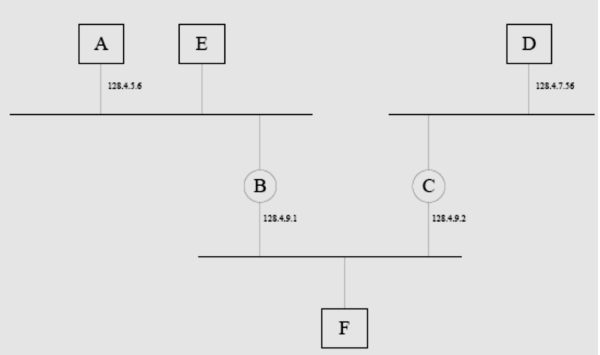
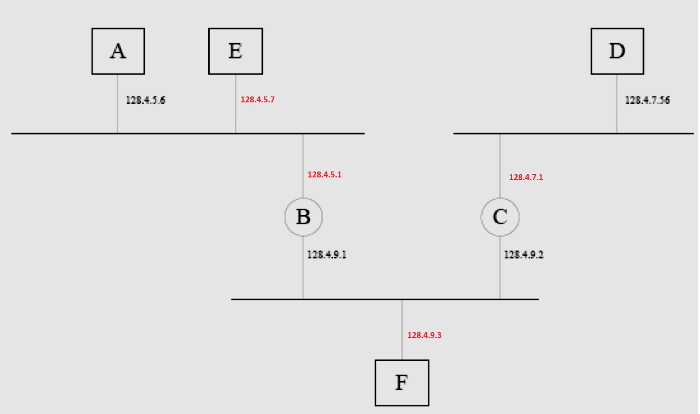
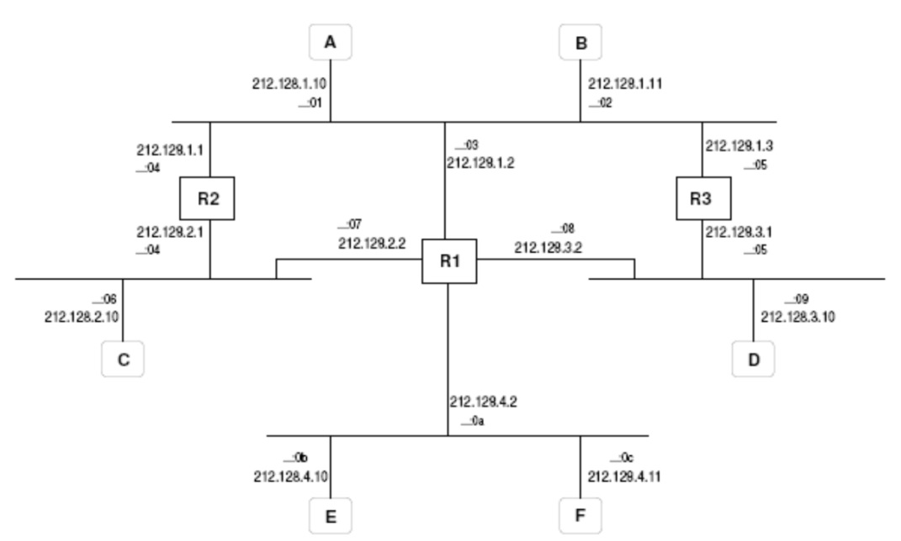

# Práctica 69

## Ejercicio 1

1º Dada la situación representada en la figura:  
a) Asignar razonadamente unas direcciones IP válidas a las interfaces de red a las que les falte.  
b) Establecer unas tablas de encaminamiento para que (simultáneamente):
- A hable con D y viceversa
- E hable con C pero no con D
- A no pueda hablar con F  

NOTA: La máscara de subred es 255.255.255.0 en todos los casos

__Solución__ 

Teniendo en cuenta la máscara dada, asignamos las siguientes direcciones a las interfaces que faltan (rn rojo):

__Tabla de A__  (omitimos las máscaras)  
128.4.5.0 ---> 0.0.0.0  
128.4.7.0 ---> 128.4.5.1  

__Tabla de B__  
128.4.5.0 ---> 0.0.0.0  
128.4.9.0 ---> 0.0.0.0  
128.4.7.0 ---> 128.4.9.2 (valdría destino 0.0.0.0)

__Tabla de C__  
128.4.9.0 ---> 0.0.0.0  
128.4.7.0 ---> 0.0.0.0
128.4.5.0 ---> 128.4.9.1    

__Tabla de D__  
128.4.7.0 ---> 0.0.0.0  
128.4.5.0 ---> 128.4.7.1
 
__tabla de E__  
128.4.9.0 128.4.5.1  
128.4.5.0 0.0.0.0 (Esta no es necesaria)  

No incluimos tabla de F porque no afecta a los requisitos dados (A ya no puede llegar a F). 

## Ejercicio 2
En la figura siguiente se muestra una red TCP/IP entre las maquinas A, B, C, D, E, y F, y los encaminadores (routers) R1, R2 y R3. Al lado de cada interfaz de comunicaciones aparece su dirección IP y su dirección Ethernet (representada por el último byte, por simplicidad). La mascara
de subred en todos los casos es 255.255.255.0

Responde razonadamente a las siguientes preguntas relacionadas con la red de la figura:
1. Si queremos situar una nueva máquina G en la misma subred en la que está C, explica razonadamente entre qué direcciones IP podríamos elegir para asignarle a G y cuales no
podríamos usar. (0.5 puntos)

Respuesta:  
    Como la máscara es /24, podría ser cualquiera de su rango de red: 212.128.2.0/24, excluyendo las dos ya asignadas. 
    Es decir, desde 212.128.2.2 a 212.128.2.254, salvo la terminada en 10. 

2. Dadas las siguientes tablas de encaminamiento:

Responde razonadamente a las siguientes cuestiones:  
a) Si A envía datagramas IP a B, ¿llegan a su destino? ¿Por qué encaminadores pasan?  
Sí, a través de R2, que tiene su correspondiente entrada para la red 212.128.1.0. A->R->B

b) Si A envía datagramas IP a C, ¿llegan a su destino? ¿Por qué encaminadores pasan?  
Por R1 y R2. A no tiene en sus entradas la salida directa por R2.   

c) Si A envía datagramas IP a E, ¿llegan a su destino? ¿Por qué encaminadores pasan?  

d) Si B envía datagramas IP a D, ¿llegan a su destino? ¿Por qué encaminadores pasan?  
e) Si B envía datagramas IP a F, ¿llegan a su destino? ¿Por qué encaminadores pasan?  