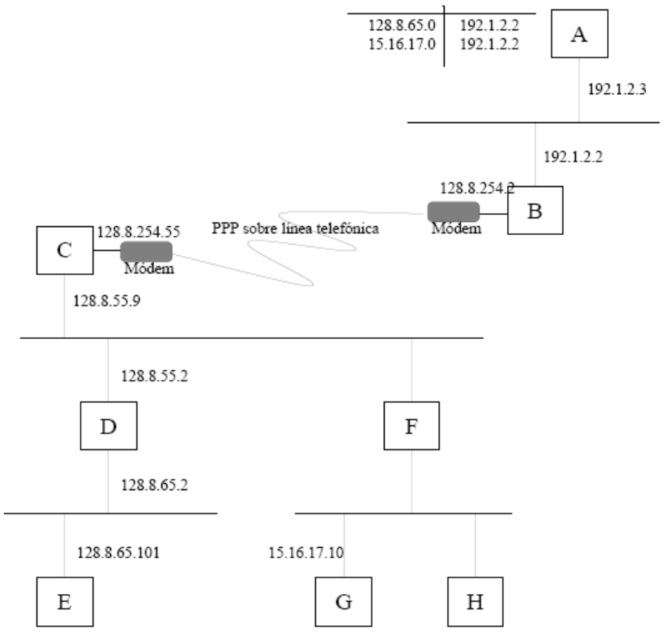
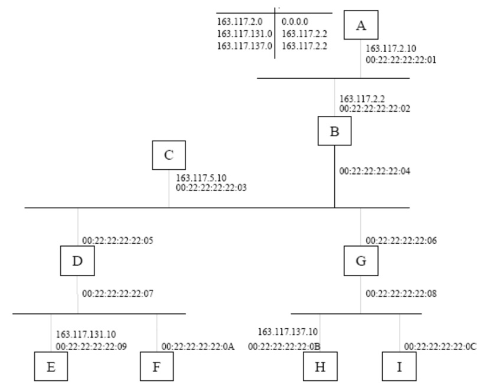
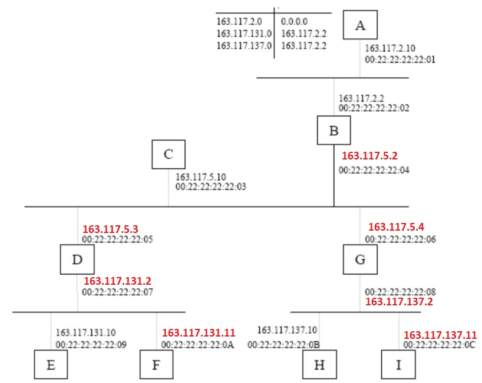
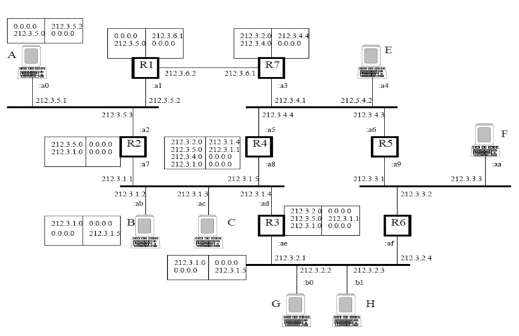
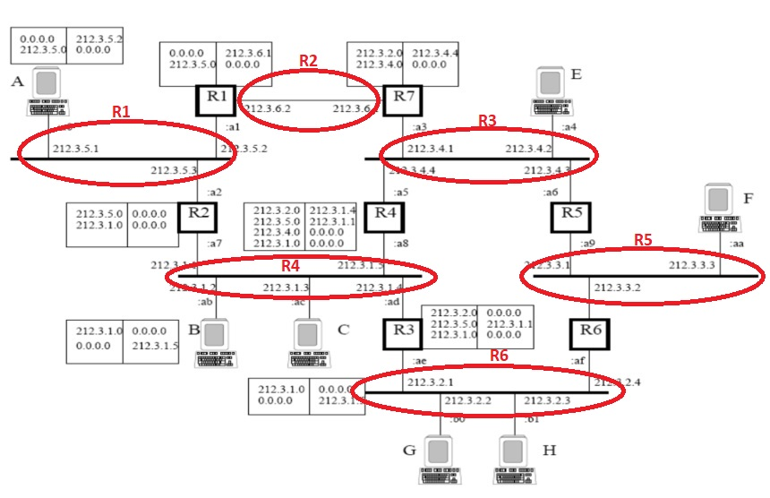
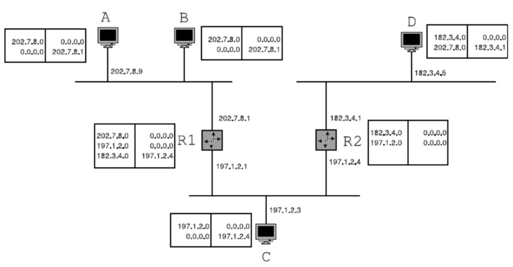

# Práctica 69

## Ejercicio 1

1º Dada la situación representada en la figura:  
a) Asignar razonadamente unas direcciones IP válidas a las interfaces de red a las que les falte.  
b) Establecer unas tablas de encaminamiento para que (simultáneamente):
- A hable con D y viceversa
- E hable con C pero no con D
- A no pueda hablar con F  

NOTA: La máscara de subred es 255.255.255.0 en todos los casos

__Solución__ 

Teniendo en cuenta la máscara dada, asignamos las siguientes direcciones a las interfaces que faltan (rn rojo):

__Tabla de A__  (omitimos las máscaras)  
128.4.5.0 ---> 0.0.0.0  
128.4.7.0 ---> 128.4.5.1  

__Tabla de B__  
128.4.5.0 ---> 0.0.0.0  
128.4.9.0 ---> 0.0.0.0  
128.4.7.0 ---> 128.4.9.2 (valdría destino 0.0.0.0)

__Tabla de C__  
128.4.9.0 ---> 0.0.0.0  
128.4.7.0 ---> 0.0.0.0
128.4.5.0 ---> 128.4.9.1    

__Tabla de D__  
128.4.7.0 ---> 0.0.0.0  
128.4.5.0 ---> 128.4.7.1
 
__tabla de E__  
128.4.9.0 128.4.5.1  
128.4.5.0 0.0.0.0 (Esta no es necesaria)  

No incluimos tabla de F porque no afecta a los requisitos dados (A ya no puede llegar a F). 

## Ejercicio 2
En la figura siguiente se muestra una red TCP/IP entre las maquinas A, B, C, D, E, y F, y los encaminadores (routers) R1, R2 y R3. Al lado de cada interfaz de comunicaciones aparece su dirección IP y su dirección Ethernet (representada por el último byte, por simplicidad). La mascara
de subred en todos los casos es 255.255.255.0

Responde razonadamente a las siguientes preguntas relacionadas con la red de la figura:
1. Si queremos situar una nueva máquina G en la misma subred en la que está C, explica razonadamente entre qué direcciones IP podríamos elegir para asignarle a G y cuales no
podríamos usar. (0.5 puntos)

    Respuesta:  
    Como la máscara es /24, podría ser cualquiera de su rango de red: 212.128.2.0/24, excluyendo las dos ya asignadas. 
    Es decir, desde 212.128.2.2 a 212.128.2.254, salvo la terminada en 10. 

2. Dadas las siguientes tablas de encaminamiento:

    Responde razonadamente a las siguientes cuestiones:  
    a) Si A envía datagramas IP a B, ¿llegan a su destino? ¿Por qué encaminadores pasan?  
    Sí. Están en la misma red y están conectados directamente por una línea, por lo que no pasan por ningún encaminador. 

    b) Si A envía datagramas IP a C, ¿llegan a su destino? ¿Por qué encaminadores pasan?  
    Por R2. A no tiene en sus entradas la salida directa por R2, pero su salida por defecto va por R2.   

    c) Si A envía datagramas IP a E, ¿llegan a su destino? ¿Por qué encaminadores pasan?  
    Irían de A a R2 (salida por defecto), De R2 a R3 (salida por defecto) y de R3 otra vez a R2 (salida por defecto), por lo que __no llegarían a E__. El TTL del datagrama llegaría a cero y sería descartado. 

    d) Si B envía datagramas IP a D, ¿llegan a su destino? ¿Por qué encaminadores pasan?  
    El camino sería B->R1->D. 

    e) Si B envía datagramas IP a F, ¿llegan a su destino? ¿Por qué encaminadores pasan?  
    B->R1->F. Sí.

3. Escribe unas tablas de encaminamiento para A, E y los encaminadores necesarios de forma que
puedan mantenerse conexiones TCP entre A y E y que los datagramas viajen por la ruta mas corta
posible (en numero de saltos).

    La ruta más corta en número de saltos entre A y E sería por A->R1->E. 

    Cambiamos la entrada  
    0.0.0.0 --> 212.128.1.1  por
    0.0.0.0 --> 212.128.1.2, para que la salida sea por R1. 

    Con esto A ya llega con un sólo salto por R1 a E. 

    Para la respuesta desde E, la tabla de E podría ser

    212.128.4.0 --> 0.0.0.0  
    0.0.0.0 --> 212.128.4.2

    La tabla de R1 es irrelevante porque ya conoce las redes de sus patas. 

## Ejercicio 3
En la figura se muestra una red basada en protocolos TCP/IP. La máscara de cada subred
es 255.255.255.0. No se permiten rutas por defecto.
La tabla de encaminamiento de A se muestra en la figura. El resto de tablas se supone que
no impiden ningún camino de comunicación.
Se pide:  
a) ¿Qué dirección IP podrá tener H? ¿y F? Justifíquese.  
b) ¿Puede hablar A con C? Justifíquese.  
c) ¿Puede hablar A con E? Justifíquese.  
d) ¿Cómo habrá que actualizar alguna tabla de encaminamiento para que A hable con C pero no con D? Justifíquese.  

__Soluciones__  
a) 
H: cualquiera de la red 15.16.17.0/24, salvo la 17.0 y la 17.255, y la 17.10. Por ejemplo, la 15.16.17.11

F (arriba): 128.8.55.3, para estar en red con la parte de arriba de D. 

F(abajo): 15.16.17.1, para estar en red con G y H. 

b) No. A no tiene esa red ni salida por defecto en su tabla. 

c) Sí, porque tiene una entrada correspondiete a la red de C.

d) La tabla de A quedaría

128.8.65.101 --> 192.1.2.2  
15.16.17.0   --> 192.1.2.2  
128.8.254.0  --> 192.1.2.2

 - Cambiamos la entrada que apuntaba a la red 128.8.65.0 por una que apunte directamente a la ip específica de E, para no perder su conectividad con E, pero sí con D. 
 - Añadimos una entrada a la red de C 128.8.254.0. También valdría una para la otra pata de C. 

 ## Ejercicio 4
En la figura se muestra una red basada en protocolos TCP/IP. La máscara de todas las
subredes es 255.255.255.0.
La tabla de encaminamiento de A se muestra en la figura. Se supone que el resto de tablas
no impiden ningún camino de comunicación.
Se pide:  
a) Asignar razonadamente todas las direcciones IP que faltan en la figura.  
b) ¿Puede hablar A con C? Justifíquese.  
c) ¿Puede hablar A con E? Justifíquese.  
d) ¿Cómo habrá que modificar la tabla de A para que pueda hablar con E pero no con F? Justifíquese.  

a) Asighamos las direcciones siguientes:

Con cuidado de respetar la red de cada pata. 

b) Puede A hablar con C?
No. No tiene la ip ni la red de C (163.117.5.0) en su tabla ni entrada default. 

c) ¿Puede hablar A con E?
Sí, porque tiene la red de E en su tabla, saliendo por B. 

d) Cambios en la tabla de A para que pueda hablar con E pero con F. 
Cambiaríamos la entrada con la dirección de red de E, por su dirección específica:  
163.117.131.0-->163.117.2.2 la cambiamos por  
163.117.131.10-->163.117.2.2  

## Ejercicio 5

La figura muestra la red de una organización compuesta por 5 redes Ethernet interconectadas por
los encaminadores R1 a R7. También existe una red punto a punto entre los encaminadores R1 y
R7.  

Al lado de cada interfaz de comunicaciones aparece la dirección IP que tiene asignada, y en el caso
de las redes Ethernet, el último byte de su dirección Ethernet (en el formato: a2). La máscara de
red en todas las subredes es 255.255.255.0.  

a) Modifica las tablas de encaminamiento para que A pueda enviar datagramas IP a F por la ruta
más corta. No debe perderse la conectividad que ofrecen las tablas de la figura. Se valorará efectuar el menor número posible de cambios.  
b) Modifica las tablas de encaminamiento para que A pueda enviar datagramas IP a H por la ruta
más corta. No debe perderse la conectividad que ofrecen las tablas de la figura. Se valorará efectuar el menor número posible de cambios.  
c) Se ha decidido realizar una reasignación de las direcciones IP a todas las interfaces de red de la
figura. Se dispone para ello únicamente del rango de direcciones IP de la subred 217.7.12.0.  
Asigna razonadamente las direcciones a las interfaces de red de la figura.1

__Soluciones__  
a) Añadimos en R7:
212.3.3.0 --> 212.3.4.3.  
Con eso R7 llega a R5 y la ruta resultante es la más corta: A->R1->R7->R5->F (3 saltos)

b) Ahora mismo A ya llega a H por R1->R7->R4->R3->H  
Son 4 saltos.   
Podríamos ahorrar saltos si vamos por R2->R3->H.   
Para ello

Tabla de A, añadimos:  
212.3.2.0 --> 212.3.5.3

R2, añadimos
212.3.2.0 --> 212.3.1.4

Y listo!

c) Analizando la figura vemos que hay en total 6 redes o dominios de difusión diferenciados. Se marcan en la figura siguiente:

Para 6 redes necesitamos 3 bits, lo que sumados a los 24 de la máscara original, nos deja 5 bits para hosts. Así que es posible.

Hacemos subnetting clásico, con máscara constante, ya que todas las subredes tienen hosts de sobra. La nueva máscara sería 255.255.255.224 (/27). 

- R1: 217.7.12.0-->217.7.12.000_00000, BC: 217.7.12.31. Direcciones a elegir entre .1 y .30.   
- R2: 212.7.12.32. BC: 212.7.12.63  
- R3: 212.7.12.64. BC: 212.7.12.95  
- R4: 212.7.12.96. BC: 212.7.12.127  
- R5: 212.7.12.128. BC: 212.7.12.159  
- R6: 212.7.12.160. BC: 212.7.12.191

Tendríamos 2 redes adicionales, que podemos usar en lugar de cualquiera de las otras:
- R7: 212.7.12.192. BC: 212.7.12.223
- R8: 212.7.12.224. BC: 212.7.12.255

## Ejercicio 6
En la figura se muestra una red. Al lado de cada máquina aparece su tabla de
encaminamiento. Al lado de cada interfaz de comunicaciones aparece su dirección IP
(salvo en el caso de la máquina B).  

La máscara de red en todas las subredes es 255.255.255.0.  

Responde razonadamente a las siguientes preguntas relacionadas con la red de la figura:
1. Asigna razonadamente una dirección IP a la interfaz de comunicaciones de la
máquina B
2. ¿Puede A enviar datagramas IP a C?
3. ¿Puede D enviar datagramas IP a C?
4. Modifica la tabla de encaminamiento de R2 para que:  
a) D pueda enviar datagramas IP a A  
b) C pueda enviar datagramas IP a A

__Solución__

1.  Podría ser cualquiera en la red 202.7.8.0/24, salvo las ocupadas, la de red y la de BC. Por ejemplo, 202.7.8.10. 
2. Sí. Su salida default va a R1, que tiene conexión directa con C. 
3. No. D no tiene ninguna entrada que encaje con su ip, con su red o salida por defecto. 
4. En R2 añadimos 202.7.8.0-->197.1.2.1. 

