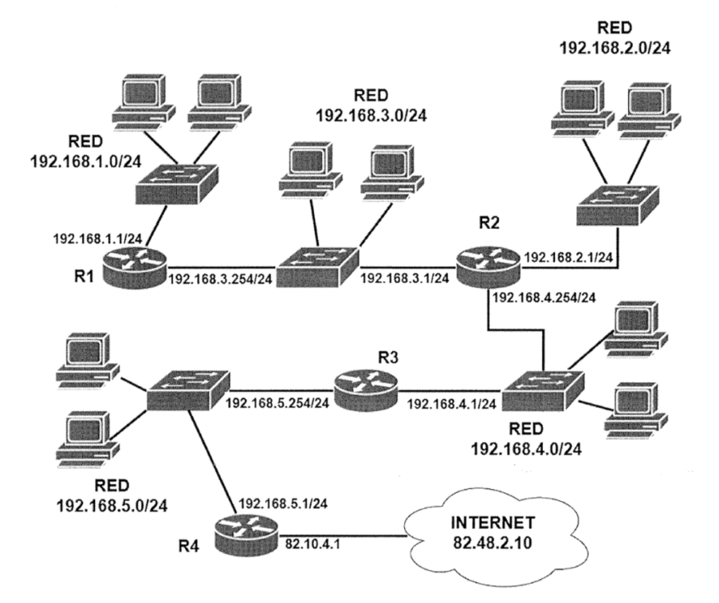

## 116 - Extremadura 2018 PES

Crea la tabla de rutas óptima de todos los equipos y Routers para
que la interconexión entre ellos sea total y todos los equipos tengan conexión a Internet.

__Solución:__
Incluiremos las redes conectadas directamente sin salto definido:  

Tabla R1:  
|Destino        |Máscara        |Gateway        |
|---------------|---------------|---------------|
|192.168.1.0    |255.255.255.0  |   NULL        |
|192.168.3.0    |255.255.255.0  |   NULL        |
|0.0.0.0        |0.0.0.0        |192.168.3.1    |

Tabla R2:  
|Destino        |Máscara        |Gateway        |
|---------------|---------------|---------------|
|192.168.2.0    |255.255.255.0  |   NULL        |
|192.168.3.0    |255.255.255.0  |   NULL        |
|192.168.4.0    |255.255.255.0  |   NULL        |
|192.168.1.0    |255.255.255.0  |192.168.3.254  |
|0.0.0.0        |0.0.0.0        |192.168.4.1    |

Tabla R3:  
|Destino        |Máscara        |Gateway        |
|---------------|---------------|---------------|
|192.168.4.0    |255.255.255.0  |   NULL        |
|192.168.5.0    |255.255.255.0  |   NULL        |
|192.168.1.0    |255.255.255.0  |192.168.4.254  |
|192.168.2.0    |255.255.255.0  |192.168.4.254  |
|192.168.3.0    |255.255.255.0  |192.168.4.254  |
|0.0.0.0        |0.0.0.0        |192.168.5.1    |

Las entradas 192.168.2.0 y 192.168.3.0 se podrían sumarizar así:
|Destino        |Máscara        |Gateway        |
|---------------|---------------|---------------|
|192.168.2.0    |255.255.254.0  |192.168.4.254  |

Tabla R4:  
|Destino        |Máscara        |Gateway        |
|---------------|---------------|---------------|
|192.168.5.0    |255.255.255.0  |   NULL        |
|192.168.1.0    |255.255.255.0  |192.168.5.254  |
|192.168.2.0    |255.255.255.0  |192.168.5.254  |
|192.168.3.0    |255.255.255.0  |192.168.5.254  |
|192.168.4.0    |255.255.255.0  |192.168.5.254  |
|0.0.0.0        |0.0.0.0        |82.48.2.10     |

De nuevo, podríamos sumarizar las entradas 2.0 y 3.0: 
|Destino        |Máscara        |Gateway        |
|---------------|---------------|---------------|
|192.168.2.0    |255.255.254.0  |192.168.5.254  |

