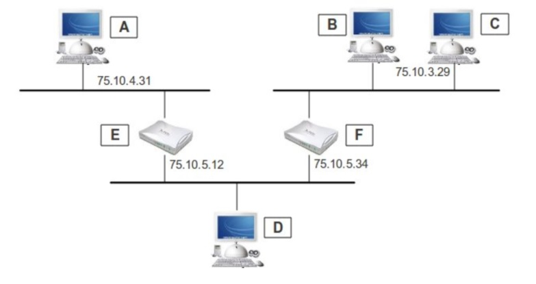
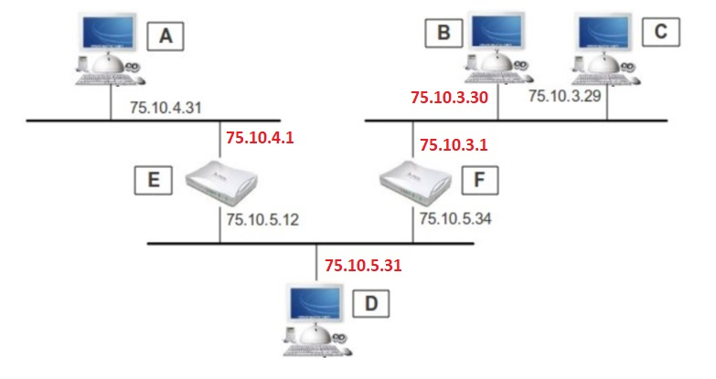

## Ejercicio 1
Si un nodo de una red tiene la dirección 172.16.45.14/30, ¿Cuál es la dirección de la subred a la  cual pertenece ese nodo?
A. 172.16.45.0  
B. 172.16.45.4  
C. 172.16.45.8  
D. 172.16.45.12  
E. 172.16.45.18  
F. 172.16.0.0  

el octeto 14, en /30 sería 000011_10. Es decir, que la red es termina en 12. Es la opción D. 

## Ejercicio 2. 
¿Cuáles de las que se mencionan a continuación son 2 direcciones IP que pueden ser asignadas 
a nodos de la subred 192.168.15.19/28?  

A. 192.168.15.17  
B. 192.168.15.14  
C. 192.168.15.29  
D. 192.168.15.16  
E. 192.168.15.31  
F. Ninguna de las que se menciona  

el octeto 19 en /28 es 0001_0011. Es decir, que pertenece a la red 192.168.15.16, y llega hasta la ip de BC 192.168.15.31. 

Por tanto, serían direcciones válidas la A y la C. 

## Ejercicio 3. 
Usted se encuentra trabajando en una empresa a la que le ha sido asignada una dirección clase 
C y se necesita crear 10 subredes. Se le requiere que disponga de tantas direcciones de nodo en  cada  subred,  como resulte  posible.  ¿Cuál  de  las  siguientes  es  la máscara  de  subred  que deberá utilizar?  

A. 255.255.255.192  
B. 255.255.255.224  
C. 255.255.255.240  
D. 255.255.255.248  
E. 255.255.255.242  
F. Ninguna de las que se menciona.  

Para crear 10 subredes necesitamos robar 4 bits de la parte de hosts de la máscara de clase C.
Así que la máscara es 255.255.255.240. La C.

## Ejercicio 4. 
¿Cuántas subredes y nodos disponibles por subred se obtienen si usted aplica una máscara 
/28 a la red clase C 210.10.2.0?  

A. 30 subredes y 6 nodos por subred.  
B. 6 subredes y 30 nodos por subred.  
C. 8 subredes y 32 nodos por subred.  
D. 32 subredes y 8 nodos por subred.  
E. 14 subredes y 14 nodos por subred.  
F. Ninguna de las anteriores  

Sería la E si excluimos las subredes todo a 0s y todo a 1s. 

## Ejercicio 5. 
¿Cuál es la dirección de subred que corresponde al nodo 172.16.210.0/22?  
A. 172.16.42.0  
B. 172.16.107.0  
C. 172.16.208.0  
D. 172.16.252.0  
E. 172.16.254.0  
F. Ninguna de las anteriores  

/22 termina la red en el tercer octeto, que corresponde al 210.  
210 en binario es 110100_10. Por tanto, la subred es la 172.16.208.0, la C.

## Ejercicio 6
¿Cuál es la dirección de subred que corresponde a la dirección IP 201.100.5.68/28?  
A. 201.100.5.0  
B. 201.100.5.32  
C. 201.100.5.64  
D. 201.100.5.65  
E. 201.100.5.31  
F. 201.100.5.80  

/28 termina en el último octeto, correspondiente al 68. En binario sería 0100_0100. Es decir, que la red termina en 64 y es la C. 

## Ejercicio 7. 
Considere las siguientes direcciones IP expresadas en binario:  
A. 01100100.00001010.11101011.00100111  
B. 10101100.00010010.10011110.00001111  
C. 11000000.10100111.10110010.01000101  

¿Cuáles de las siguientes afirmaciones son correctas respecto de estas 3 direcciones? (Elija 3)  

A. La dirección C es una dirección pública clase C.  
B. La dirección C es una dirección privada clase C.  
C. La dirección B es una dirección pública clase B.  
D. La dirección A es una dirección pública clase A.  
E. La dirección B es una dirección privada clase B.  
F. La dirección A es una dirección privada clase A  

La dirección A es 100.10.235.39. Es clase A, pero las privadas de clase A van de 10.0.0.0 a 10.255.255.255. (Las que empiezan por 10.x).

La dirección B es 172.18.158.15. El rango privado de clase B es de 172.16.0.0 a 172.31.255.255. Así que es clase B privada. 

La dirección C es 192.167.178.69. 
En clase C las privadas van de 192.168.0.0 a 192.168.255.255. La 192.167.x.x está fuera del rango privado, así que es pública.

Las opciones correctas son A, D y E. 

## Ejercicio 8. 
¿Cuál es el rango, expresado en nomenclatura binaria, del primer octeto de direcciones IP 
clase B?  
A. 00001111 – 10001111  
B. 00000011 – 10011111  
C. 10000000 – 10111111  
D. 11000000 – 11011111  
E. 11100000 – 11101111  
F. Ninguna de las anteriores   

Las clase B empiezan siempre por 10, así que sólo encaja la C. 
Van desde la 10_000000 a 10_111111. Es decir, desde 128.x a 191.x. 

## Ejercicio 9. 
La  empresa  en  la  que  se  desempeña  tiene  asignada  la  dirección  clase  B  172.12.0.0.  De acuerdo a las necesidades planteadas, esta red debería ser dividida en subredes que soporten un  máximo  de  459  nodos  por  subred,  procurando  mantener  en  su  máximo  el  número  de subredes disponibles ¿Cuál es la máscara que deberá utilizar?  
A. 255.255.0.0  
B. 255.255.128.0  
C. 255.255.224.0  
D. 255.255.254.0  
E. 255.255.248.0  
F. 255.255.192.0  

Para 459 hosts necesitamos 9 bits (29 = 512 => 510 hosts). 

La máscara de clase B es 255.255.0.0. Es decir, /16

Si reservamos 9 bits para hosts en cada subred nos quedan, nos quedan 23 bits en total para la red. Por tanto, de máscara 255.255.254.0. La opción D. 

## Ejercicio 10 
Dada la red 192.168.0.0/24, desarrolle un esquema de direccionamiento que cumpla  con los siguientes requerimientos. Use VLSM, es decir, optimice el espacio de  direccionamiento tanto como sea posible.  
1. Una subred de 20 hosts para ser asignada a la VLAN de Profesores
2. Una subred de 80 hosts para ser asignada a la VLAN de Estudiantes
3. Una subred de 20 hosts para ser asignada a la VLAN de Invitados
4. Tres  subredes de 2 hosts para ser asignada a los enlaces entre enrutadores.

__Solución__

Empezamos siempre por las subredes más grandes, y vamos hacia las más pequeñas. 

 - La VLAN Estudiantes necesita 80 hosts. Por tanto, necesita 7 bits. Nos quedan 25 bits para red + subred. Es decir, una /25. 
     - Red: 192.168.0.0/25. --> 192.168.0.0_0000000
     - BC: 192.168.0.0_1111111 --> 192.168.0.127/25
     - Hosts desde 192.168.0.1/25 hasta 192.168.0.126/26. 
- Invitados y profesores tienen los mismos requerimientos. Así que vamos con la VLAN Invitados. Necesita 20 hosts. Por tanto, 5 bits para hosts. 27 bits para red. 
     - Red: 192.168.0.128/27 --> 192.168.0.100_00000
     - BC: 192.168.0.100_11111 --> 192.168.0.159/27
     - Hosts desde 192.168.0.129/27 hasta 192.168.0.158/27  
     _Truco: Si sabes que te da para 32 nodos, sumas 30 a la red y restas 1 (porque empieza en 0) y ya tienes el BC._
- VLAN Profesores. De nuevo con /27.
    - Red: 192.168.0.160/27 --> 192.168.0.101_00000
    - BC: 192.168.0.101_11111 --> 192.168.0.191/27
    - Hosts desde 192.168.0.161 hasta 192.168.0.190
- Tres subredes de 2 hosts. Cada una necesita 2 bits para hosts. Es decir, 30 bits para red. /30
     - Red enlace 1: 
         - Red: 192.168.0.192/30. 
         - Hosts: 192.168.0.193/30 y 192.168.0.194/30
         - BC: 192.168.0.195/30
     - Red enlace 2:
         - Red: 192.168.0.196/30
         - Hosts 192.168.0.197/30 y 192.168.0.198/30
         - BC: 192.168.0.199/30
    - Red enlace 3:
        - Red: 192.168.0.200/30
        - Hosts 192.168.0.201/30 y 192.168.0.202/30
        - BC: 192.168.0.203/30

Nos quedan desde 204 en adelante para futuros crecimientos de subredes. 

## Ejercicio 11 
Dada la situación representada en la figura siguiente:  

a) Asigna una dirección IP válida a aquellas interfaces de red a las que les falte.  

b) Establece unas tablas de encaminamiento para que, simultáneamente:
- A hable con C y viceversa
- B hable con E pero no con A
- C no pueda hablar con D

NOTA: La máscara de subred es 255.255.255.0 en todos los casos.

__Solución__

HAY QUE REVISARLA BIEN, EN CUANTO A LA CONEXIÓN DE D CON DOS ROUTERS DISTINTOS. 

Nos dan la máscara. Así que sabemos los rangos de hosts con los que jugar en cada red.

Las direcciones que faltan podrían ser estas:

Basado en los requisitos del enunciado, las tablas de encaminamiento serán:

Empezamos por los routers
  
__Tabla de E__ 
|Destino       |Máscara       |Gateway        |(Notas                               |
|--------------|--------------|---------------|-------------------------------------|
|75.10.4.0     |255.255.255.0 |0.0.0.0        |0.0.0.0 Indica que no tiene GW, pq está conevctada directamente 
|75.10.5.0     |255.255.255.0 |0.0.0.0        |Bis
|75.10.3.0     |255.255.255.0 |75.10.5.34     |

__Tabla F__
|Destino       |Máscara       |Gateway        |(Notas                               |
|--------------|--------------|---------------|-------------------------------------|
|75.10.3.0     |255.255.255.0 |0.0.0.0        |
|75.10.5.0     |255.255.255.0 |0.0.0.0        |
|75.10.4.0     |255.255.255.0 |75.10.5.12     |

Seguimos con los PCs. 

__Tabla de A__  
Tiene que poder hablar con C y viceversa. Le permitimos llegar a todos (aunque algunos no podrán responderle).   

|Destino       |Máscara       |Gateway        |(Notas                               |
|--------------|--------------|---------------|-------------------------------------|
|75.10.4.0     |255.255.255.0 |75.10.4.1      |Por si se añaden otros PCs en la red. No es necesaria |
|0.0.0.0       |0.0.0.0       |75.10.4.1      |Salida por defecto. Para Internet u otras

__Tabla de B__  
Tiene que poder hablar con E, pero no con A. Por tanto, no debe conocer la red de A.

|Destino       |Máscara       |Gateway        |(Notas                               |
|--------------|--------------|---------------|-------------------------------------|
|75.10.3.0     |255.255.255.0 |75.10.3.1      |Le permite comunicarse con D         |
|75.10.5.0     |255.255.255.0 |75.10.3.1      |Bus con E                            |

No le incluimos ruta por defecto 0.0.0.0, porque si no incluiría la ruta de A en ella

__Tabla de C__   
No puede hablar con D. Así que le damos todas las rutas menos la de la red de D (75.10.5.0)  

|Destino       |Máscara       |Gateway        |(Notas                               |
|--------------|--------------|---------------|-------------------------------------|
|75.10.3.0     |255.255.255.0 |75.10.3.1      |Le permite comunicarse con B         |
|75.10.4.0     |255.255.255.0 |75.10.3.1      |Bis con A                            |

__Tabla de D__ 
No indica requisitos específicos. Pero entendemos que podrá hablar con todos, salvo los que no pueden hablar con él, que no le podrán responder. 

|Destino       |Máscara       |Gateway        |(Notas                               |
|--------------|--------------|---------------|-------------------------------------|
|75.10.4.0     |255.255.255.0 |75.10.5.12     |Le permite comunicarse con A         |
|0.0.0.0       |0.0.0.0       |75.10.5.34     |Default para hablar con B y C        |

Nota: En la topología del ejercicio, se asume que entre el PC D y los routers E y F debe haber un switch que segmenta la red 75.10.5 en dos vlans. 

