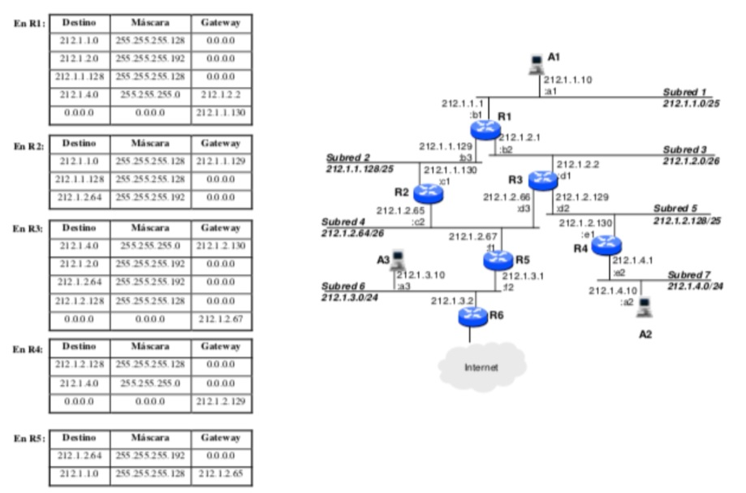

## Práctica 68. Encaminamiento
En la siguiente figura se muestra la topología de la red de una organización, las direcciones
IP y direcciones Ethernet (sólo el último byte, por simplicidad) de cada una de las
interfaces de red, así como las direcciones de cada una de las subredes.  
Suponiendo que las máquinas A1, A2 y A3 tienen correcta su configuración IP, conteste a
las siguientes cuestiones:  

a) Según las tablas de encaminamiento que se muestran en la figura, explicar razonadamente si A1 y A2 pueden intercambiar tráfico IP. Si no es así, realice las
modificaciones mínimas necesarias en las tablas de encaminamiento para que sea posible.  

b) Según las tablas de encaminamiento que se muestran en la figura, explicar razonadamente si A1 y A3 pueden intercambiar tráfico IP. Si no es así, realice las
modificaciones mínimas necesarias en las tablas de encaminamiento para que sea posible.

__Solución__  
__Apartado a)__  
Veamos si A1 puede llegar hasta A2 y viceversa. Empezamos por la ruta desde A1 a A2 (212.1.4.0/24). 

A1 está en la subred1 y A2 en la subred7. Un paquete desde A1 a A2 iría por la 4ª entrada de la tabla de R1, hacia R3. 

Analizamos la tabla de R3  
- 212.1.4.0/24 (Subred 7) por 212.1.2.130 (R4)

Esta entrada ya encajaría con la petición indicada proviniente de R1. Así que el paquete viajaría a R4. 

Analizamos la tabla de R4.  
Tiene una entrada propia 212.1.4.0/24. Así que encaminaría bien el paquete hacia A2. 

Por tanto, sí, A1 puede enviar a A2 siguiendo la ruta R1->R3->R4. 

Veamos si A2 puede responder a A1 (212.1.1.10/25)
Volvemos a analizar R4:  
212.1.2.128/25 (Subred 5)  
212.1.4.9/24 (Subred 7)  
0.0.0.0 por 212.1.2.129 (R3)  

El paquete no encontraría una ruta específica, así que iría por la ruta por defecto, hacia R3. 

R3 tampoco tiene una ruta específica hacia la subred 1 de A1. Así que iría por la ruta por defecto que es
0.0.0.0 por 212.1.2.67 (R5)

El paquete iría a R5.   
R5 tiene una ruta específica para la subred1, por 212.1.2.65 (R2). Así que el paquete iría a R2. 

R2 también tiene una entrada específica a la subred 1 por 212.1.1.129 (R1). 

R1 tiene la entrada correspondiente a su pata en la subred1, así que el paquete llegaría hasta A1. 

Por tanto, el camino de vuelta sería A2->R4->R3->R5->R2->R1->A1

Podría mejorarse esa ruta, pero no es lo que pide el ejercicio. 

__apartado b)__  
A1 y A3 pueden intercambiar tráfico? Vamos más rápido.
A1 está en 212.1.1.0/25 (subred 1)  
A3 está en 212.1.3.0/24  (subred 6)

R1 no tiene ruta específica para la subred 6, así que iría por su ruta por defecto hacia R2. 

R2 tampoco tiene la subred 6 en su tabla. Y no tiene una ruta por defecto, así que el paquete no pasaría de ahí. Por tanto, no se pueden comunicar. 

¿Cómo podríamos tratar de arreglarlo? Añadiendo la entrada
|Destino       |Máscara         |Gateway        |
|--------------|----------------|---------------|
|0.0.0.0       |0.0.0.0         |212.1.2.67     |

Es decir, redirigimos el tráfico no contemplado en las otras rutas por R5. 

Con esto el paquete viajaría de R2 a R5. 
R5, pese a tener una pata en la subred 6, no tiene su entrada correspondiente, así que no la reconocería...

Añadimos la entrada correspondiente a su tabla:
|Destino       |Máscara         |Gateway        |
|--------------|----------------|---------------|
|212.1.3.0     |255.255.255.0   |0.0.0.0        |

Con esto el paquete llegaría desde A1 a A3 siguiendo la ruta A1->R1->R2->R5->A3

Podría responder A3 a A1?
 
R5 tiene una entrada a la red de 212.1.10/25 por 212.1.2.65 (R2). El paquete viajaría a R2. 

R2 también tiene la entrada a la subred 1, por R1. Y R1 tiene contemplada su pata en R1. Así que sí, llegaría la respuesta sin necesidad de ningún cambio:  
 A3->R5->R2->R1->A1

