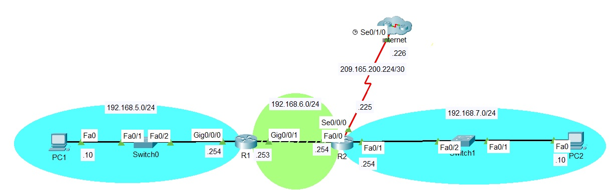

# PAT en routers Cisco (IOS)
Amósanse os pasos para configurar PAT nun router "fronteira", que fai de ponte entre as nosas redes privadas e o noso ISP.

Partimos da topoloxía da imaxe, como exemplo



No cluster que representa internet temos simplemente un router representando o router do ISP, coa interface debidamente configurada.

Por tanto, o router fronteira e R2. E a interface que fai de traductor NAT será Se0/0/0. 

O obxectivo é que todas as solicitudes que proveñan das redes 192.168.5.0/25, .6.0/24 e .7.0/24, sexan traducidas pola ip da interface Se0/0/0 de R2 e máis un porto "efímero" (1024 para arriba). Ao recibir as respostas, farase de forma automática a traducción inversa. 

Para elo, seguimos os seguintes pasos:

## 1 - Definir unha lista de acceso, indicando as redes ou ips ás que se lles desexa aplicar a traducción.

Lembrade que por defecto, nunha ACL deniégase todo, polo que normalmente debemos indicar qué tráfico se permite:

```
R2(config)#access-list 1 permit 192.168.5.0 0.0.0.255
R2(config)#access-list 1 permit 192.168.6.0 0.0.0.255
R2(config)#access-list 1 permit 192.168.7.0 0.0.0.255
```

Se non sabedes cómo configurar listas de acceso, podedes ver unha miniguía aquí: [guía ACLs Cisco](https://github.com/mcventur/redes/blob/main/Tutoriales/Comandos%20switches%20y%20routers/README.md#listas-de-acceso-acl)

## 2 - Definimos la interfaz interna y externa
Usamos el comando ```ip nat inside|outside``` __en modo de configuración de interfaz__, para indicar las interfaces internas y la interfaz externa. 

En este caso, las interfaces Fa0/0 y Fa0/1 de R2 son las internas. 
```
R2(config)#int fa0/0
R2(config-if)#ip nat inside

R2(config)#int fa0/0
R2(config-if)#ip nat inside
```

La interfaz externa es la se0/0.  

```
R2(config)#int serial0/0/0
R2(config-if)#ip nat outside
R2(config-if)#exit
```

## 3 - Activamos NAT en modo PAT 
En modo __configuración general__, se usa el comando 

```Router(config)# ip nat inside source list [numero_acl] interface [interfaz_externa] overload``` 

para activar la traducción, indicando la lista de acceso correspondiente al trafico interno a traducir, y la interfaz de salida. 

Siguiendo el ejemplo dado, sería:

```
R2(config)#ip nat inside source list 1 interface se0/0/0 overload
```

Con esto ya tendríamos la traducción funcional. Podríamos hacer ping desde la red interna al router del ISP. 

## Revisar lista de traducciones hechas

Después de hacer uso de NAT, Podemos ver la lista de traducciones realizadas con el comando

```
R2#show ip nat translations
```