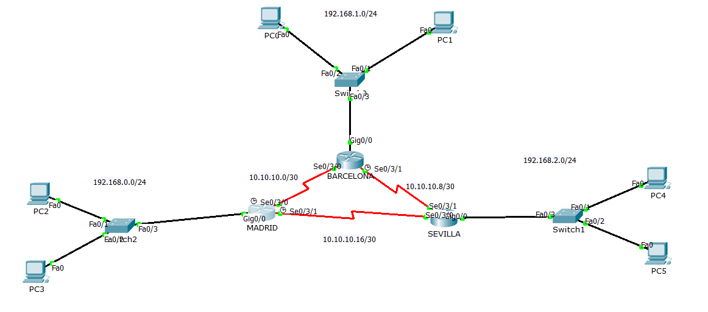
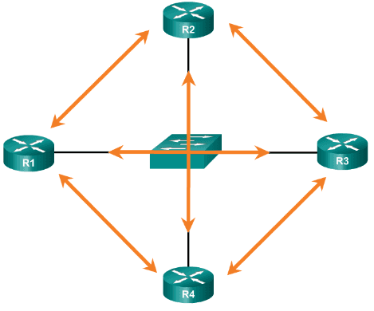
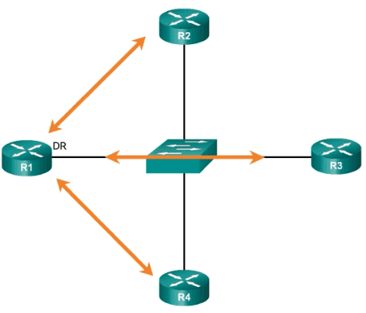
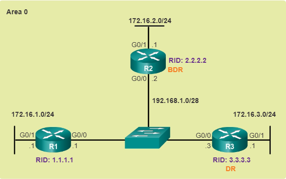

# Configuración de Switch

## Para crear vlans (en modo privilegiado):

Laas VLAN nos permiten crear distintos dominios de difusión, distintas subredes lógicas con un conmutador de capa 2. No tocamos nada de ips realmente en el switch (en los PCs sí). 

```
Switch#config terminal
Enter configuration commands, one per line.  End with CNTL/Z.
Switch(config)#vlan 100
Switch(config-vlan)#name probando
```
Darle nombre es opcional. La vlan estaría creada al indicar el comando vlan X. 

Para borrarla:
```
Switch(config)#no vlan 100
```

Para ver las vlan creadas
```
Switch#show vlan brief
```

Para asignar interfaces a las vlans, accedemos a la interface desde el modo config, y usamos el comando switchport access:
```
Switch(config)#interface FastEthernet 0/1
Switch(config-if)#switchport mode access !Para activar el acceso de una única vlan a ese puerto
Switch(config-if)#switchport access vlan 30
```

Haríamos lo propio con cada interface que queramos asignar a una vlan. 

## Modo trunk

Si una interfaz dada del switch transporta tráfico de varias vlan (distintas subredes segmentadas), entonces esa interfaz debe configurarse en modo trunk. Por ejemplo, en la siguiente imagen, la interfaz Fa0/3, que va al router:


Para ello, en la configuración de la interface usamos el comando switchport mode trunk

```
Switch(config)#interface fa0/3
Switch(config-if)#switchport mode trunk
```
Si no indicamos nada, todas las vlan que tengan GW del router podrán llegar a él por ese enlace troncal y comunicarse con el resto. Pero podemos indicar explócitamente qué vlans pueden usar ese enlace troncal:

```
Switch3(config-if)# switchport trunk allowed vlan 1,30
```

Esto evitaría que cualquier vlan distinta de la 1 o la 30 pase por ese enlace hacia el router. 


## Para asignar una ip de administración remota
Para asignar una ip para acceso por telnet o ssh se suele asignar a la interface virtual de la vlan 1, que viene creada por defecto
```
Switch(config)#interface vlan 1
Switch(config-if)#ip address 192.168.0.15 255.255.255.0
Switch(config-if)#no shutdown
``` 
`no shutdown` se asegura de que la interface esté operativa.   

Tras esto, tenemos que configurarlo para habilitar las lineas vty (lineas de terminal virtuales), que van generalmente de 0 a 4. 
```
Switch(config)#service password-encryption
Switch(config)#line vty 0 4
Switch(config-line)#password exame
Switch(config-line)#login
```
- Para almacenar la contraseña encriptada, tenemos que habilitar previamente el servicio password-encryption. Opcional. 
- Con `line vty 0 4` le indicamos que vamos a configurar las 4 líneas de administración remota. 
- Con `password exame` asignamos la clave.
- Con `login` indicamos que solicite la contraseña para el acceso. 

## Para habilitar ssh en lugar de telnet
Si en lugar de telnet queremos usar ssh en el switch, tenemos que asignarle un gateway por defecto (la ip de un router) para que sepa por donde responder a los paquetes que vengan de fuera de su red.  

Hemos asignado la ip 192.168.0.130 a la interface vlan1 del switch, que es la que usaremos para gestión. Esa ip está en la red 192.168.0.128/26.

Tenemos que asignarle un hostname y un nombre de dominio, ya que ssh usa certificados basados en dominio:
```
Switch(config)#hostname Switch1
Switch1(config)#ip domain-name opos2025.com
```
Generamos una clave rsa
```
Switch1(config)#crypto key generate rsa
```
Creamos usuario y contraseña
```
Switch1(config)#username marce password exame
```
Y para que sólo acepte ssh y no telnet:
```
Switch1(config)#line vty 0 4
Switch1(config-line)#transport input ssh
Switch1(config-line)#login local
```
`login local` indica que use la bdd de usuarios local, con el usuario que creamos antes con su contraseña. Pedirá usuario y contraseña al conectarse.  


# Configuración de routers

## Configurar interface troncal 
La interface Gig0/0 del router de la imagen anterior también debe estar conigurado como troncal, para aceptar el tráfico de las dos vlan. Es decir, la interfaz Gig0/0 se segmentará en dos subinterfaces lógicas Gig0/0.30 y Gig0/0.35 (para las vlan 30 y 35 creadas en el switch). 

- Se configura una interface virtual con el comando `interface <fisica>.x`. Para la x se suele usar la id de la vlan. 
- Seguidamente se habilita el modo trunk (802.1Q) con el comando `encapsulation dot1Q x` Donde __la x aquí sí que tiene que coincidir con la id de la vlan__, para que la reconozca. 
- Por último, le asignamos la ip que hará de puerta de enlace para la vlan
### VLAN configuradas en el ejemplo
Vemos aquí como se hace para dos vlan, 30 y 35, creadas en el switch, que segmenta la red 192.168.0.0/24 en dos redes:
- Vlan 30: 192.168.0.0/26
- Vlan 35: 192.168.0.64/26
- Vlan 1 (por defecto). 192.168.0.128/26. Tiene el acceso telnet en la ip 192.168.0.130

```

Router1(config-if)#interface GigabitEthernet 0/0.30
Router1(config-subif)#encapsulation dot1Q 30
Router1(config-subif)#ip address 192.168.0.1 255.255.255.192

Router1(config-subif)#interface Gig0/0.35
Router1(config-subif)#encapsulation dot1Q 35
Router1(config-subif)#ip address 192.168.0.65 255.255.255.192 

Router1(config-subif)#interface Gig0/0.1
Router1(config-subif)#encapsulation dot1Q 1
Router1(config-subif)#ip address 192.168.0.129 255.255.255.192 
```

## Configurar acceso por ssh
Se hace casi igual que en el switch:
```
Router1(config)#ip domain-name opos2025.com
Router1(config)#hostname Router1
Router1(config)#username usuario1 password exame
Router1(config)#line vty 0 4
Router1(config-line)#login local
Router1(config-line)#transport input ssh
```
Importante: Si queremos que el usuario tenga más privilegios, deberíamos usar el comando `username usuario1 privilege 15 password exame`. Añadiendo el privilege 15 tenemos máximos privilegios. De lo contrario, por defecto es el mínimo (0). 

Generamos la clave RSA
```
Router1(config)#crypto key generate rsa
```

Y para que use la versión 2 de SSH, más segura:
```
Router1(config)#ip ssh version 2
```

podemos configurar otros parámetros, como el timeout o los intentos de login permitidos:
```
Router1(config)#ip ssh authentication-retries 3
Router1(config)#ip ssh time-out 60
```
Podemos verificar que el servicio está activo:
```
Router1#show ip ssh
SSH Enabled - version 2.0
Authentication timeout: 60 secs; Authentication retries: 3
```

## Configurar router como servidor DHCP
Vemos cómo configurar un router Cisco para que haga de servidor DHCP en una red LAN. 

1. Activamos el servicio
    ```
    Router(config)#service dhcp
    ```
2. Damos un nombre a la cola de direccionamiento
    ```
    Router(config)#ip dhcp pool PAR_LAN
    ```
    Al hacer esto ya se pasa al modo de configuración del pool dhcp  

3. Indicamos el rango de direcciones
    ```
    Router1(dhcp-config)#network 192.168.1.0 255.255.255.0
    ```
4. Indicamos la puerta de enlace que se entrega a los clientes
    ```
    Router1(dhcp-config)#default-router 192.168.1.1
    ```
5. Indicamos el servidor DNS a entregar
    ```
    Router1(dhcp-config)#dns-server 192.168.1.2
    ```
6. Podemos excluir direcciones reservadas de la asignación (en modo config general)
    ```
    Router(config)#ip dhcp excluded-address 192.168.1.1 192.168.1.5
    ```
    Permite excluir también rangos de direcciones
    `ip dhcp excluded-address <start address> [<end address>]`. Por ejemplo:
    ```
    Router(config)#ip dhcp excluded address 192.168.0.200 192.168.0.254
    ```


## Listas de Acceso (ACL)
Podemos crear listas de acceso estándar y extendidas para usar el router como cortafuegos. 

### ACL estándar
Se numeran de 1 a 99 y sólo permiten indicar la dirección de origen. Para ello, se usa una máscara wildcard (justo al revés que la máscara de red).

Se definen con el comando `access-list <num> {deny|permit} <host> <wildcard>`. Por ejemplo: 

```
Router(config)#access-list 1 permit 192.168.4.0 0.0.0.255
Router(config)#access-list 1 permit 192.168.6.0 0.0.0.255
Router(config)#access-list 1 deny any
```
Una vez creada la ACL, se debe asignar al menos a una interfaz, para filtrar tráfico entrante o saliente. Se hace en modo de configuración de la interfaz correspondiente con el comando `ip access-group <num-ACL> {in|out}`. Por ejemplo:

```
Router(config-if)#ip access-group 1 out
```

### ACL extendida
Las ACL extendidas se  numeran entre 100 y 199 y permiten indicar protocolos, puertos y direcciones de destino entre otros. 

Su sintaxis general de definición es:
```
Router(config)# access-list <num> {deny | permit} 
protocol source source-wildcard [operator {port}] destination destination-wildcard [operator {port}]
```
El operator que se aplica al puerto puede ser cualquier operador de comparación, como __lt__ (menor que), __gt__ (mayor que), __eq__ (equal), __neq__ (not equal), y a continuación el puerto.

Para aplicarlo a una interfaz se usa el mismo comando que en las ACL estándar. 

Un ejemplo:
```
R1(config)# access-list 110 permit tcp 192.168.10.0 0.0.0.255 any eq 443
R1(config)# interface g0/0/0
R1(config-if)# ip access-group 110 in
R1(config-if)# exit
```

## Protocolos de enrutamiento

Para ver los protocolos de enrutamiento dinámico activos usaremos el comando `show ip protocols`

Usaremos el siguiente esquema para ejemplificar la configuración de protocolos




### Protocolo RIP
Para habilitar RIP en su versión 2. 

Lo vemos en el router MADRID:
```
Router(config)#router rip
Router(config-router)#version 2
Router(config-router)#network 192.168.0.0
Router(config-router)#network 10.10.10.0
Router(config-router)#network 10.10.10.16
Router(config-router)#passive-inteface gig0/0
```
Se habilita rip, y en la configuración del protocolo se se indican las redes conectadas, sin máscara, y la versión 2.   

También hemos indicado una interface pasiva, la que apunta de cada al interior de la red, porque no hay rutas por esa interfaz que requieran recibir actualizaciones rip. Así evitamos introducir en esa red mensajes inútiles. 

Otro ejemplo, en el router SEVILLA
```
Router(config)#router rip
Router(config-router)#version 2
Router(config-router)#network 192.168.2.0
Router(config-router)#network 10.10.10.16
Router(config-router)#network 10.10.10.8
Router(config-router)#passive-interface gi0/0
```

Y en BARCELONA
```
Router(config)#router rip
Router(config-router)#version 2
Router(config-router)#network 192.168.1.0
Router(config-router)#network 10.10.10.0
Router(config-router)#network 10.10.10.8
Router(config-router)#passive-interface gi0/0
```

Para mostrar la configuracion de rip usaremos el comando `show ip rip`

### Protocolo OSPF

OSPF es más moderno que rip y usa métricas mas complejas y avanzadas, y mecanismos de sincronización más optimizados. 

```
Router(config)#router ospf 1
Router(config-router)#network 192.168.0.0 0.0.0.255 area 0
Router(config-router)#network 10.10.10.0 0.0.0.3 area 0
Router(config-router)#network 10.10.10.16 0.0.0.3 area 0
```

- En el primer comando activamos ospf y le damos un id de proceso ospf, que es un id local y no tiene que coincidir con el resto. 
- En los siguientes comandos le indicamos las redes que queremos que sea capaz de almacenar y comunicar a otros routers OSPF. La ma´scara en formato wildcard, y el área. 
- Si sólo hay un área, se recomienda que sea la 0 por si crece. Si hay varias, una tiene que ser la 0 (backbone). El área sí debe ser común en todos los routers que comparten área. 

Adicionalmente podemos indicar la id ospf del router con
```
router-id 1.1.1.1
```
Se da como si fuese una ip. Si no se la indicamos, usará la ip loopback más alta, o la ip de interfaz más alta. 
En el router MADRID no se la he puesto y al ejecutar show ip ospf muestra:
```
Router#show ip ospf
 Routing Process "ospf 1" with ID 192.168.0.1
 ...
```
Hacemos lo propio en el resto de routers. 

SEVILLA:
```
Router(config)#router ospf 1
Router(config-router)#router-id 2.2.2.2
Router(config-router)#network 10.10.10.16 0.0.0.3
Router(config-router)#network 10.10.10.8 0.0.0.3 area 0
Router(config-router)#network 192.168.2.0 0.0.0.255 area 0
```
En este caso le he dado un id ospf manual. 

BARCELONA
```
Router(config)#router ospf 1
Router(config-router)#network 192.168.1.0 0.0.0.255 area 0
Router(config-router)#network 10.10.10.0 0.0.0.3 area 0
Router(config-router)#network 10.10.10.8 0.0.0.3 area 0
```

Si cambiamos el id ospf de un router, desde el modo privilegiado ejecutamos lo siguiente para resetear el proceso ospf (recargarña las tablas y registros correspondientes).

Por ejemplo, en Sevilla he hecho:
```
Router(config)#router ospf 1
Router(config-router)#router
Router(config-router)#router-id 3.3.3.3
Router(config-router)#exit
```

Y como se observa, no se ha refrescado esa información:
```
Router#show ip protocols

Routing Protocol is "ospf 1"
  Outgoing update filter list for all interfaces is not set 
  Incoming update filter list for all interfaces is not set 
  Router ID 2.2.2.2
  ...
```

Así que ejecutamos el comando de reseteo del proceso ospf:
```
Router#clear ip ospf process
Reset ALL OSPF processes? [no]: yes
```

lo que refrescará el id al nuevo:
```
Router#show ip protocols

Routing Protocol is "ospf 1"
  Outgoing update filter list for all interfaces is not set 
  Incoming update filter list for all interfaces is not set 
  Router ID 3.3.3.3
  ...
```

### Eleccion de DR y DBR (Designated Router y Designated Backup Router) en OSPF
Cuando varios routers OSPF están conectados en un mismo segmento de red (como una LAN Ethernet), la forma en que comparten esta información puede volverse ineficiente si no se optimiza. Aquí es donde entran en juego el DR y el BDR.

Por ejemplo, en la imagen siguiente:
- Existen más de 2 routers en una misma red, conectados a través de un Switch, sin vlans.
- Todos los routers comunicarían sus registros OSPF con todos.



En redes de accesos múltiples como el de la figura, OSPF elige un DR y un DBR para que funcionen como puntos de recolección de y distribución de los registros de la bdd ospf (LSBD), que constituye su tabla de rutas. El BDR entra en juego si falla el DR. 

Al hacerlo, se simplifican y diminuyen los mensajes y solicitudes OSPF:



Al resto de routers de la red multiacceso se les denomina DROthers. 

Para elegir un DR y BDR el proceso es el siguiente:
- Los routers de la red se presentan e intercambian sus prioridades e ids ospf. 
- El router con la prioridad más alta se elige como DR. En caso de empate, el que tenga el router id mayor.
- Entre los routers restantes, se elige como BDR el de mayor prioridad, o en caso de empate, el de mayor ID. 

En la ilustración, todas las interfaces Ethernet del router tienen una prioridad determinada de 1. Como resultado, para seleccionar el DR y el BDR se usa la ID del router OSPF. El R3, con la ID de router más alta, se convierte en el DR, y el R2, que tiene la segunda ID de router más alta, se convierte en el BDR.



Las prioridades se asignan a cada interfaz, de 1 a 255, siendo por defecto 1. 

Si se asigna 0 entonces ese router no puede ser designado DR ni BDR en la red propia de esa interfaz. 

Para cambiar la prioridad de una interfaz
```
Router(config)#interface Se0/3/0
Router(config-if)#ip ospf priority 255
Router(config-if)#end
```

## Interfaces loopback
Las interfaces loopback son interfaces lógicas del router que no se asignan a puertos físicos y por tanto no se pueden conectar a otro dispositivo.   
Son útiles para probar y administrar dispositivos.   
El proceso de habilitación y asignación de una dirección de loopback es simple:
```
Router(config)# interface loopback number
Router(config-if)# ip address <ip-address> <subnet-mask>
Router(config-if)# exit
```

## Enrutamiento estático

Se definen con el comando `ip route`:
```
Router(config)#ip route 192.160.2.0 255.255.255.0 192.168.3.2
Router(config)#ip route 0.0.0.0 0.0.0.0 192.168.1.20
```
La segunda seria una ruta predeterminada o por defecto, para paquetes que no encajen en las anteriores. 


