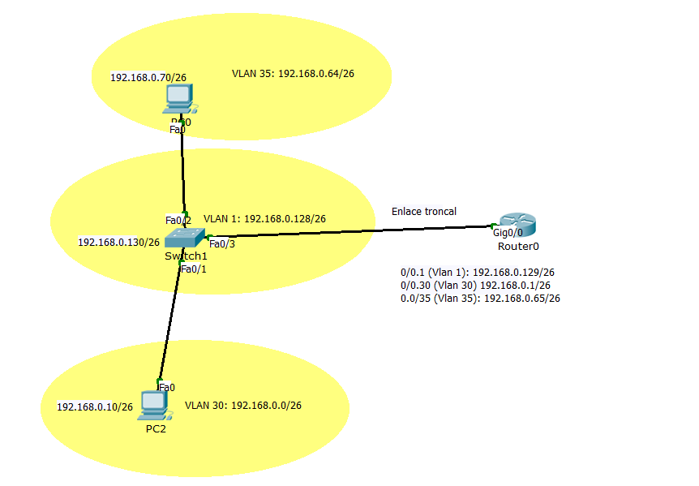

# Configuración de Switch

## Para crear vlans (en modo privilegiado):

Laas VLAN nos permiten crear distintos dominios de difusión, distintas subredes lógicas con un conmutador de capa 2. No tocamos nada de ips realmente en el switch (en los PCs sí). 

```
Switch#config terminal
Enter configuration commands, one per line.  End with CNTL/Z.
Switch(config)#vlan 100
Switch(config-vlan)#name probando
```
Darle nombre es opcional. La vlan estaría creada al indicar el comando vlan X. 

Para borrarla:
```
Switch(config)#no vlan 100
```

Para ver las vlan creadas
```
Switch#show vlan brief
```

Para asignar interfaces a las vlans, accedemos a la interface desde el modo config, y usamos el comando switchport access:
```
Switch(config)#interface FastEthernet 0/1
Switch(config-if)#switchport access vlan 30
```

Haríamos lo propio con cada interface que queramos mover asignar a una vlan. 

## Modo trunk

Si una interfaz dada del switch transporta tráfico de varias vlan (distintas subredes segmentadas), entonces esa interfaz debe configurarse en modo trunk. Por ejemplo, en la siguiente imagen, la interfaz Fa0/3, que va al router:



Para ello, en la configuración de la interface usamos el comando switchport mode trunk

```
Switch(config)#interface fa0/3
Switch(config-if)#switchport mode trunk
```
Si no indicamos nada, todas las vlan que tengan GW del router podrán llegar a él por ese enlace troncal y comunicarse con el resto. Pero podemos indicar explócitamente qué vlans pueden usar ese enlace troncal:

```
Switch3(config-if)# switchport trunk allowed vlan 1,30
```

Esto evitaría que cualquier vlan distinta de la 1 o la 30 pase por ese enlace hacia el router. 


## Para asignar una ip de administración remota
Para asignar una ip para acceso por telnet o ssh se suele asignar a la interface virtual de la vlan 1, que viene creada por defecto
```
Switch(config)#interface vlan 1
Switch(config-if)#ip address 192.168.0.15 255.255.255.0
Switch(config-if)#no shutdown
``` 
`no shutdown` se asegura de que la interface esté operativa.   

Tras esto, tenemos que configurarlo para habilitar las lineas vty (lineas de terminal virtuales), que van generalmente de 0 a 4. 
```
Switch(config)#service password-encryption
Switch(config)#line vty 0 4
Switch(config-line)#password exame
Switch(config-line)#login
```
- Para almacenar la contraseña encriptada, tenemos que habilitar previamente el servicio password-encryption. Opcional. 
- Con `line vty 0 4` le indicamos que vamos a configurar las 4 líneas de administración remota. 
- Con `password exame` asignamos la clave.
- Con `login` indicamos que solicite la contraseña para el acceso. 

## Para habilitar ssh en lugar de telnet
Si en lugar de telnet queremos usar ssh en el switch, tenemos que asignarle un gateway por defecto (la ip de un router) para que sepa por donde responder a los paquetes que vengan de fuera de su red.  

Hemos asignado la ip 192.168.0.130 a la interface vlan1 del switch, que es la que usaremos para gestión. Esa ip está en la red 192.168.0.128/26.

Tenemos que asignarle un hostname y un nombre de dominio, ya que ssh usa certificados basados en dominio:
```
Switch(config)#hostname Switch1
Switch1(config)#ip domain-name opos2025.com
```
Generamos una clave rsa
```
Switch1(config)#crypto key generate rsa
```
Creamos usuario y contraseña
```
Switch1(config)#username marce password exame
```
Y para que sólo acepte ssh y no telnet:
```
Switch1(config)#line vty 0 4
Switch1(config-line)#transport input ssh
Switch1(config-line)#login local
```
`login local` indica que use la bdd de usuarios local, con el usuario que creamos antes con su contraseña. Pedirá usuario y contraseña al conectarse.  


# Configuración de routers

## Configurar interface troncal 
La interface Gig0/0 del router de la imagen anterior también debe estar conigurado como troncal, para aceptar el tráfico de las dos vlan. Es decir, la interfaz Gig0/0 se segmentará en dos subinterfaces lógicas Gig0/0.30 y Gig0/0.35 (para las vlan 30 y 35 creadas en el switch). 

- Se configura una interface virtual con el comando `interface <fisica>.x`. Para la x se suele usar la id de la vlan. 
- Seguidamente se habilita el modo trunk (802.1Q) con el comando `encapsulation dot1Q x` Donde __la x aquí sí que tiene que coincidir con la id de la vlan__, para que la reconozca. 
- Por último, le asignamos la ip que hará de puerta de enlace para la vlan
### VLAN configuradas en el ejemplo
Vemos aquí como se hace para dos vlan, 30 y 35, creadas en el switch, que segmenta la red 192.168.0.0/24 en dos redes:
- Vlan 30: 192.168.0.0/26
- Vlan 35: 192.168.0.64/26
- Vlan 1 (por defecto). 192.168.0.128/26. Tiene el acceso telnet en la ip 192.168.0.130

```

Router1(config-if)#interface GigabitEthernet 0/0.30
Router1(config-subif)#encapsulation dot1Q 30
Router1(config-subif)#ip address 192.168.0.1 255.255.255.192

Router1(config-subif)#interface Gig0/0.35
Router1(config-subif)#encapsulation dot1Q 35
Router1(config-subif)#ip address 192.168.0.65 255.255.255.192 

Router1(config-subif)#interface Gig0/0.1
Router1(config-subif)#encapsulation dot1Q 1
Router1(config-subif)#ip address 192.168.0.129 255.255.255.192 
```

## Configurar acceso por ssh
Se hace casi igual que en el switch:
```
Router1(config)#ip domain-name opos2025.com
Router1(config)#hostname Router1
Router1(config)#username usuario1 password exame
Router1(config)#line vty 0 4
Router1(config-line)#login local
Router1(config-line)#transport input ssh
```
Importante: Si queremos que el usuario tenga más privilegios, deberíamos usar el comando `username usuario1 privilege 15 password exame`. Añadiendo el privilege 15 tenemos máximos privilegios. De lo contrario, por defecto es el mínimo (0). 

Generamos la clave RSA
```
Router1(config)#crypto key generate rsa
```

Y para que use la versión 2 de SSH, más segura:
```
Router1(config)#ip ssh version 2
```

podemos configurar otros parámetros, como el timeout o los intentos de login permitidos:
```
Router1(config)#ip ssh authentication-retries 3
Router1(config)#ip ssh time-out 60
```
Podemos verificar que el servicio está activo:
```
Router1#show ip ssh
SSH Enabled - version 2.0
Authentication timeout: 60 secs; Authentication retries: 3
```


