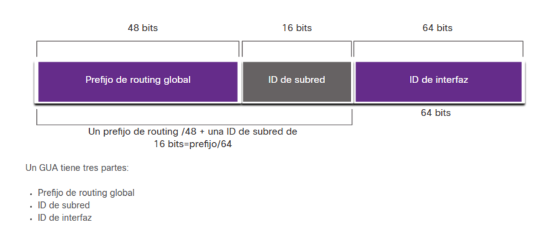
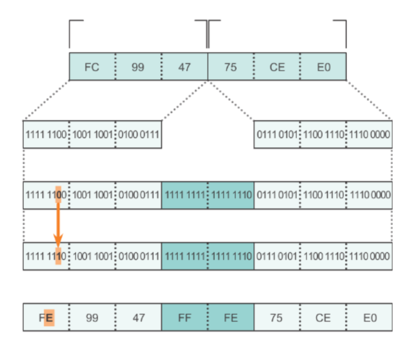

# Direcciones IPv6

Las direcciones ipv6 están formadas por 8 hextetos, cada hexteto 16 bits con 4 dígitos hexadecimales. 

Existen 3 tipos de direcciones IPv6:
 - __Unicast o Unidifusión__: Una dirección exclusiva para una interfaz de un dispositivo de red. 
 - __Multicast o Multidifusión__: Es una dirección que representa a varias interfaces. 
 - __Anycast o Difusión por proximidad__: Es una dirección asignada a varios dispositivos, pero los envíos a dicha dirección se entregarán __sólo al dispositivo más cercano__ con ella. 

 La dirección de origen de un paquete tienen que ser obligatoriamente de unicast, pero las de destino pueden ser de unicast o multicast.

 ## Tipos de direcciones Unicast
 Un dispositivo IPv6 puede tener direcciones de distintos tipos asignadas. Las más comunes e importantes son:

  - __Dirección Global de Unicast, o Global Unicast Address (GUA)__. Son el equivalente a las direcciones IPv4 públicas. Únicas para cada dispositivo globalmente. Para asignarlas, la IANA asigna bloques de direcciones a los RIR, y estos a los ISP, que las distribuyen entre sus clientes. 

    Son opcionales. No es obligatorio tener una. Van del rango 2000 a 3FFF. 
  - __Dirección local de enlace o Link-Local Address (LLA)__. Son el equivalente a las direcciones IPv4 privadas, y sólo permiten comunicarse dentro de la red (enlace en terminología ipv6) local.   
    Suelen estar dentro de la red FE80::/10 (desde FE80:: a FEFB::) y __es obligatorio tener una__ para habilitar el uso de ipv6. 
 - Dirección de Loopback: __::1__
 - Dirección sin especificar: __::__

 Esta es la estructura habitual de una dirección GUA:  



## Configuración de GUA en un router Cisco

```
R1(config)# interface g0/0
R1(config-if)# ipv6 address 2001:db8:acad:a::1/64
```

## Configuración de LLA en un router Cisco
```
R1(config)# interface g0/0
R1(config-if)# ipv6 address fe80::1 link-local
```

En Cisco IOS, por defecto, aunque configures direcciones IPv6 en las interfaces, el router no reenvía paquetes IPv6 entre interfaces hasta que se habilita explícitamente con este comando.  
```
R1(config)# ipv6 unicast-routing
```
Sin él, el router actúa como un host ipv6 (no enruta). 

## Para mapear una dirección IPv4 a una IPv6:
### Siguiendo RFC 6145

Ejemplo. 192.168.20.112

1. Primero pasamos la dirección a hexadecimal:  
    1.1 Empezamos pasándola a binario (y separo en grupos de 4):  
    1100 0000.1010 1000.0001 0100.0111 0000  
    1.2. Ahora la pasamos a Hexadecimal (grupos de 4 bits):  
    C0.A8.14.70
2.	Incluimos __::FFFF__ a la izquierda y agrupamos en hextetos:  
::FFFF:C0A8:1470/48

>También se admite la notación decimal punteada alternativa:  
::FFFF:192.168.20.112

### Usando 6to4 (para túneles entre redes ipv6 y redes ipv4)
Igual que RFC 6145 usamos la notación hexadecimal de la ipv4, pero todo a la izquierda (los ceros a la derecha) y empezando por 2002:. Es decir:  

2002:C0A8:1470::/48

## Proceso EUI-64 para calcular IPv6
Proceso definido por el IEEE para generar el ideentificador de interfaz (últimos 64 bits de la IPv6) a partir de la MAC. 



Ilustramos el proceso con la MAC 52:74:f2:b1:a8:7f

1. Se parte la MAC por el medio (cortamos entre el identificador de fabricante y el de dispositivo) e insertamos FFFE en medio:  
    52:74:f2:__ff:fe__:b1:a8:7f
3. Pasamos el segundo dígito hexadecimal a binario para el paso 3:  
    5 __0010__:74:f2:ff:f3:b1:a8:7f
4. Invertimos el 7º bit (3º del segundo dígito hexadecimal):  
    __0000__:74:f2:ff:f3:b1:a8:7f
5. Volvemos a pasar a hexadecimal y agrupamos en hextetos.  
    __5074:f2ff:f3b1:a87f__

A partir de esto, si nos piden una dirección LLA (privada), tendremos que añadirle el prefijo FE80::/10 a la izquierda quedando  
FE80::5074:f2ff:f3b1:a87f/64

Si fuese sin DHCPv6, el dispositivo escucharía los RA (Router Announcement) del enlace local comunicando el prefijo de red, que sustituiría al FE80::, por ejemplo, 2001:db8:1::/64, quedando:  
2001:db8:1:5074:f2ff:f3b1:a87f/64