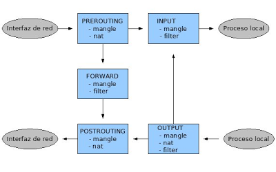

# TUTORIAL IPTABLES

## Sintaxis
(requiere `sudo` o su):

```bash
# iptables -t [tabla] operación cadena parámetros acción
```

El parámetro `-t [tabla]` es opcional. Si no se indica, se aplica en la tabla `filter`.  
Las cadenas y acciones se suelen escribir en mayúsculas, pero simplemente por convención (es insensible a las mayúsculas o minúsculas) para estos elementos.

## Tabla filter
Reglas de filtrado de paquetes.  
**Sintaxis típica:**

```bash
iptables -t filter -A [INPUT|OUTPUT|FORWARD] [-i 'interfaz de red de entrada'] [-o 'interfaz de red de salida'] [-s 'dirección ip de origen'] [-d 'dirección ip de destino'] [-p tcp|udp|icmp] [-dport 'puerto de destino'] [--sport 'puerto de origen'] [-j ACCEPT|DROP|REJECT]
```

### Cadenas
- **INPUT**: Los paquetes que llegan con destino al propio firewall.
- **OUTPUT**: Paquetes originados en el propio firewall que van a salir.
- **FORWARD**: Paquetes en los que el firewall solo hace de puente, que se reenvían.

## Tabla nat
Reglas NAT (Network Address Translation) para modificar el origen o destinatario de un paquete.  

**Sintaxis:**

```bash
# iptables -t nat -A POSTROUTING -o 'interfaz salida' -s 'dirección IP origen' -d 'dirección IP destino' -p 'protocolo' --dport 'puerto de destino' -j SNAT --to 'nueva IP de origen'
```

### Cadenas
- **PREROUTING**: Esta cadena se aplica al paquete antes de ser procesado por la interfaz de entrada, antes de tomar la decisión de enrutamiento, tan pronto como llegan al equipo.
- **POSTROUTING**: Esta cadena se aplica al paquete tras tomar la decisión de enrutamiento, antes de salir de la interfaz de salida.
- **OUTPUT**: Para modificar paquetes que se originan directamente en el equipo cortafuegos.

## Tabla Mangle
Para modificar ciertos flags, marcas u opciones avanzadas en los paquetes: TOS, TTL, ...  
Cuenta con las cadenas INPUT, OUTPUT, PREROUTING, POSTROUTING y FORWARD.

## Flujo de un paquete
El flujo que sigue un paquete sería:  


**Ejemplo**: Un paquete que se origina en nuestra red local y va destinado a una máquina de Internet:

1. El paquete entra en el cortafuegos por una interfaz de red, por tanto, primero se comprobarían las reglas de la cadena PREROUTING.
2. A continuación, se comprobarían las reglas de la cadena FORWARD, ya que el paquete no va destinado a un proceso del cortafuegos, sino que va a atravesarlo, saliendo por la interfaz que lo conecta con la red externa.
3. Por último, si el paquete no ha sido filtrado y sigue adelante, antes de salir del cortafuegos por la otra interfaz de red, se comprueban las reglas de la cadena POSTROUTING.

## Operaciones
Las posibles operaciones (ver sintaxis) que se pueden realizar sobre las reglas son:

- **-A, --append**: Añade una regla al cortafuegos. Ejemplo:

```bash
iptables -t filter -A INPUT -p tcp -j DROP
```

Esta regla bloquea todo el tráfico TCP entrante dirigido a la IP de cualquier interfaz del cortafuegos.

- **-D, --delete**: Elimina una regla. Si quisiéramos eliminar la regla anterior sería:

```bash
iptables -D INPUT -p tcp -j DROP
```

También se puede usar el número de regla (ver `-L` con `--line-numbers`).

- **-I, --insert**: Inserta una regla en una determinada posición. Si no se indica la posición, se inserta al principio. Por ejemplo, para añadir una regla que rechace todo el tráfico entrante TCP como cuarta regla:

```bash
iptables -I INPUT 4 -p tcp -j DROP
```

- **-R, --replace**: Reemplaza la regla de número indicada por otra. Ejemplo para reemplazar la anterior:

```bash
iptables -R INPUT 4 -p tcp -j DROP
```

- **-L, --list**: Lista todas las reglas de una cadena. Por ejemplo, para listar todas las reglas de la cadena INPUT:

```bash
iptables -L INPUT
```

Añadiendo `--line-numbers` nos mostrará el número de cada regla.

- **-F, --flush**: Elimina todas las reglas de una cadena.

```bash
iptables -F INPUT
```

- **-P, --policy**: Cambia la política por defecto para una cadena. Ejemplo para rechazar todos los paquetes entrantes:

```bash
iptables -P INPUT DROP
```

## Parámetros
Algunos parámetros que nos permiten especificar mejor los paquetes sobre los que aplicar las reglas:

- **-p, --protocol**: Para restringir el protocolo de los paquetes sobre los que actuar. Protocolos de la capa de transporte: `tcp`, `udp`, `icmp`.
- **-s, --source**: Para restringir la IP de origen de los paquetes sobre los que actuar.
- **-d, --destination**: Para restringir la IP de destino de los paquetes sobre los que actuar.
- **-i, --in-interface**: Para restringir la interfaz de entrada de los paquetes sobre los que actuar. Ej: `eth0`, `enp0s3`, ...
- **-o, --out-interface**: Para restringir la interfaz de red de salida.
- **--dport** o **--sport**: Filtramos por puertos de destino o de origen del paquete.  
  Se pueden indicar varios puertos separados por comas añadiendo `-m multiport --dports` (¡con S!).  
  También se pueden indicar rangos, sin necesidad de la opción anterior, con dos puntos. Ejemplo: `80:82`.  
  Puertos de servicios habituales: `dns` (udp/53), `ftp` (tcp/21), `ssh` (tcp/22), `http` (tcp/80 o tcp/8080) y `https` (tcp/443).

## Acciones o targets
Una vez definida la regla, toca indicar la acción a ejecutar sobre el paquete seleccionado. Se indica con el parámetro `-j` seguido de alguno de los valores siguientes:

- **ACCEPT**: El paquete será aceptado.
- **DROP**: Se elimina el paquete sin notificar el equipo de origen.
- **REJECT**: Se elimina el paquete, pero en este caso se notifica al host de origen con un paquete ICMP. Se pueden indicar los motivos con `--reject-with respuesta`, con respuesta posible: `icmp-host-unreachable`, `icmp-port-unreachable`, etc.
- **DNAT**: Esta acción es utilizada en la cadena PREROUTING de la tabla NAT para modificar la IP de destino. Tiene que llevar asociado el parámetro `--to-destination`, que puede incluir también el puerto.

```bash
sudo iptables -t nat -A PREROUTING -p tcp --dport 80 -j DNAT --to-destination 192.168.1.10:80
```

**Uso típico**: Cuando tenemos un servidor web en una LAN privada. Traduciremos en PREROUTING todas las solicitudes a la IP pública al puerto 80 (o el 443) por la IP privada del servidor.

- **SNAT**: Acción asociada en la cadena POSTROUTING para modificar la IP origen por una IP de destino fija. Al igual que el caso anterior, le tiene que acompañar el parámetro `--to`. Ejemplo:

```bash
iptables -t nat -A POSTROUTING -s 192.168.1.0/24 -o eth0 -j SNAT --to 203.0.113.1
```

- **MASQUERADE**: Acción equivalente a SNAT pero utilizada cuando tenemos una dirección IP dinámica en la interfaz de salida. Es un poco más lento ya que comprueba la IP de la interfaz de salida para cada paquete. Ejemplo:

```bash
iptables -t nat -A POSTROUTING -s 192.168.1.0/24 -o eth0 -j MASQUERADE
```

**Uso típico**: Equipos de nuestra red que salen a internet para conectarse con servidores externos (web, ftp u otro tipo). Traduciremos en POSTROUTING (el destino no cambia) la IP privada de origen de todas las solicitudes dirigidas a los puertos correspondientes (80, 21, 22) por la IP pública.  
Al usar SNAT o MASQUERADE, el propio iptables se encarga de realizar la traducción inversa NAT de la respuesta recibida, mediante una tabla de correspondencia que almacena.

- **REDIRECT**: Se utiliza en la cadena PREROUTING para modificar la dirección IP que tenga la interfaz de red de entrada.

## Notas
En general, actuamos sobre la IP de destino en PREROUTING, antes de enrutar (después no tendría sentido). Y actuamos sobre la IP de origen en el POSTROUTING, cuando los paquetes ya han sido enrutados y tienen el destino definitivo.

- **LOG**: Registra las conexiones que encajan con el filtro indicado en el log del sistema (normalmente `/var/log/syslog`). Se puede añadir un prefijo al log para facilitar su filtrado con `--log-prefix`. Ejemplo:

```bash
iptables -A INPUT -p tcp --dport 22 -j LOG --log-prefix "SSH connection attempt: "
```

- **RETURN**: El paquete dejará la cadena en la que se encuentre, pero continuará por la cadena superior a esa si es que existe.
- **MARK**: Establece marcas en el paquete. Sólo es válido en la tabla mangle, pero no fuera de ella.
- **TOS**: Modifica el campo Type Of Service de la cabecera del paquete.
- **TTL**: Modifica el campo Time To Live de la cabecera del paquete.

## Notas adicionales
1. Si nos piden permitir el reenvío de paquetes para un equipo usando un script bash, el código sería el siguiente:

```bash
#!/bin/bash
echo "1" > /proc/sys/net/ipv4/ip_forward
# Podríamos añadir esta regla con la política por defecto para permitir el reenvío en la tabla filter
iptables -t filter -P FORWARD ACCEPT
```